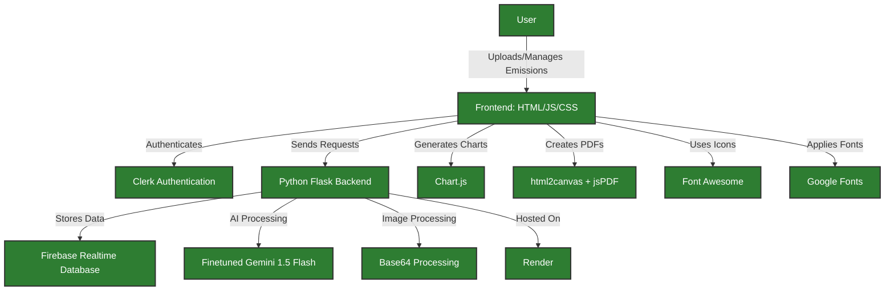

# Carbon.ai

**Track Your Environmental Impact With AI**

**Carbon.ai** is an advanced AI-driven platform that helps users track, analyze, and reduce their carbon footprint. It simplifies the complexities of sustainability and provides actionable insights for eco-friendly living.

## 🚀 Demo

[Link to live demo >](https://carbon-ai-web.web.app/)

**Note:** For security reasons, API keys and database credentials have been omitted from the codebase. While you won’t be able to run the code locally, you can review the entire codebase. Please use the demo link above to see **Carbon.ai** in action.

## 🎯 Problem Statement

Our planet is on the brink of an environmental crisis, with rising temperatures, frequent natural disasters, and dwindling resources. **Carbon emissions are at the core of this challenge**, stemming from everyday actions like our commutes, diet, shopping habits, and energy use. It’s easy to feel overwhelmed by the scale of the problem, making it hard for individuals to see how their contributions matter. **Carbon.ai** was born out of the need to empower people to take meaningful steps toward reducing their carbon footprint. We wanted to make sustainability not just accessible, but actionable, turning complex data into insights that inspire change. Because saving the planet shouldn’t be confusing—it should be a choice we all can make, one step at a time.

## 💡 Solution

**Carbon.ai** offers a comprehensive and user-friendly solution for carbon footprint management:

- **AI-Powered Data Analysis**: Upload receipts, images, or type in data manually, and the AI will calculate your carbon emissions with precision.
- **Manual Entry**: Option for manual data entry to ensure flexibility in tracking.
- **Dynamic Search and Filtering**: Effortlessly explore and filter data by category, type, description, or date.
- **Detailed Emission Cards**: Each activity gets an eco report card with a breakdown of the impact and actionable tips.
- **Interactive Visualization**: Clear charts for visualizing emissions, making it easy to identify patterns.
- **User Management Features**: Flexibility to edit, reset, or delete data entries.
- **PDF Reports**: Generate and download detailed PDF reports of your carbon data.
- **Dark Mode**: An eye-friendly mode that proves sustainability can be stylish.
- **Personalized Recommendations**: Receive AI-powered, practical tips for reducing your carbon footprint.

## 🛠️ Technology Stack

- **Frontend**: HTML, CSS, JavaScript
- **Backend**: Flask (Python)
- **Database**: Firebase Realtime Database
- **Authentication**: Clerk
- **AI**: Finetuned Gemini 1.5 Flash
- **Image Processing**: Base64 encoding
- **Charts**: Chart.js
- **PDF Generation**: html2canvas, jsPDF
- **Icons**: Font Awesome
- **Fonts**: Google Fonts
- **Hosting**: Render (Backend) and Firebase (Frontend)

## ✨ Key Features

- **Comprehensive Carbon Tracking**: Monitors emissions across purchases, travel, food, waste management, and carbon offset activities, offering a complete overview of your carbon footprint.
 
- **AI-Powered Data Analysis**: Whether users upload images, input data manually, or scan receipts, AI algorithms process and quantify carbon emissions accurately, taking the guesswork out of sustainability.
 
- **Detailed Emission Cards**: Each action comes with its own eco report card that breaks down its environmental impact and provides practical, actionable tips for improvement.
 
- **Interactive Data Visualization**: Engaging and easy-to-understand charts turn complex data into clear visuals, making it simple to identify trends and make informed decisions.
 
- **Dynamic Search and Filtering**: Users can explore their carbon data by category, type, description, or date—all without needing cumbersome filters.
 
- **User Management and Customization**: Offers complete flexibility with features to edit, reset, or delete data entries, ensuring users have control over their records.
 
- **Manual Data Entry**: Supports manual entry to log data when automatic processing isn’t an option, making tracking inclusive and flexible.
 
- **Personalized Recommendations**: Provides AI-driven, tailored tips that are as insightful as they are practical, guiding users to make smarter, lower-emission choices.
 
- **Reporting and Sharing**: Generates comprehensive PDF reports for easy sharing, making it simple to showcase progress and inspire eco-conscious action in others.
 
- **Dark Mode and User-Friendly Design**: Offers an intuitive, visually appealing interface with a dark mode option, proving that eco-conscious apps can also be stylish and easy on the eyes.

## 📋 Potential Impact

- **Empowering Informed Choices** - Carbon.ai provides users with AI-powered data-driven insights, leading to better, eco-friendly decisions that can reduce carbon footprints by up to 65%.
 
- **Detailed Emission Cards with Tips** - Each entry includes a detailed breakdown with environmental impact descriptions and practical tips, enabling users to take immediate steps.
 
- **Personalized AI Recommendations** - The app offers tailored tips and actionable advice to help users reduce their emissions, making sustainable living simpler and more achievable.
 
- **Sustained Engagement Through Visualization** - Interactive dashboard with charts and real-time analytics keep users motivated by showing clear, visual progress in reducing emissions.
 
- **Comprehensive Life Tracking** - Carbon.ai tracks emissions across purchases, food, waste, energy, transport, and offset activities, providing a complete view of a user’s carbon footprint.

## 🚀 Getting Started

1. Clone the repository
2. Install dependencies using `requirements.txt`
3. Replace the API Keys and database credentials for Gemini, Firebase and Clerk
4. Run the application using the Flask Backend

---

Built with ❤️ for empowering individuals to make eco-friendly choices and contribute to a sustainable future.
